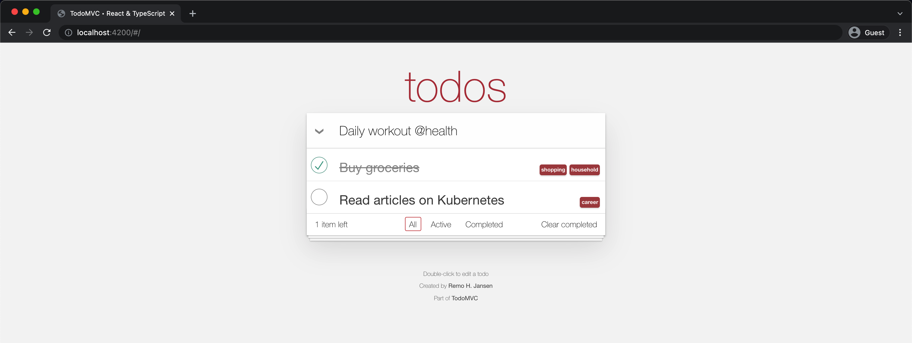

<p align="center">
    
</p>

<h1 align="center">TodoMVC - TypeScript & React</h1>


> TodoMVC is a project which offers the same Todo application implemented using MV* concepts in most of the popular JavaScript MV* frameworks of today. For this project, we will be going with the TypeScript & React implementation.

> _[TodoMVC - todomvc.com](http://todomvc.com)_

> TypeScript is a language for application-scale JavaScript development. TypeScript is a typed superset of JavaScript that compiles to plain JavaScript. Any browser. Any host. Any OS. Open Source.

> _[TypeScript - typescriptlang.org](http://typescriptlang.org)_

> React is a JavaScript library for creating user interfaces. Its core principles are declarative code, efficiency, and flexibility. Simply specify what your component looks like and React will keep it up-to-date when the underlying data changes.

> _[React - facebook.github.io/react](http://facebook.github.io/react)_

<br>

# Table of Contents

0. [Project Setup](#project-setup)
1. [Introduction](#introduction)
2. [Task One](#task-one)
3. [Task Two](#task-two)
4. [Task Three](#task-three)
5. [Notes](#notes)

<br>

> ## Project Setup
* Clone project repository using -> 
  ```
  git clone https://github.com/krizten/react-tsc-todomvc.git
  ```
* Install project repository using -> 
  ```
  npm install
  ```
* To run a local development instance of the project, after installing the dependencies, run the command -> 
  ```
  npm run dev
  ```
* To build and serve project for production, run the following commands ->
  ```
  npm run build
  npm start
  ```

<br>

> ## Introduction

Our frontend stack consists of React with TypeScript and various backends using REST and GraphQL APIs. You might have heard of [TodoMVC](http://todomvc.com/). It's a neat project which contains a reference implementation of a simple to-do app written in various JavaScript frameworks, libraries and dialects. The quality of the various implementations vary and your goal will be to improve one of the implementations and to add new features.

<br>

> ## Task One

Fork the project from GitHub. The implementation we are interested in is located in [examples/typescript-react](https://github.com/tastejs/todomvc). 

Start it using:
```cd examples/typescript-react && npm install && npm build && npm start```

Try to answer the following questions:

1. What would you do differently?
2. What's good?
3. What's bad?
4. Are you missing anything in the tooling department?

Optionally, if you think it will help you, apply some of your suggestions to the code.
<br><br><br>

<h3>
	<span style="color:white;background-color:#3b49df;padding:5px 10px">Task One - Solution</span>
</h3>
<br>

<h4 style="font-weight:bold">1. What would you do differently?</h4>

* Use a bundler like Webpack to set up development and production build.
* Ensure project dependencies are up to date.
* Use a more organized folder structure to separate compiled JS files, TypeScript React components and other utilities methods.
* Add tests and coverage reports
* Set up linting, formatting and style guides (Standard, Airbnb, Google, etc).

<br>

<h4 style="font-weight:bold">2. What's good?</h4>

* Use of TypeScript for type inference and to easily detect possible errors during compile-time.
* Use of components and classes to separate concerns, improve maintainability and readability.
* Use of custom utility methods instead of importing 3rd party libraries (leading to increased bundle size).
<br>

<h4 style="font-weight:bold">3. What's bad?</h4>

* No development workflow included.
* No component tests, integration (e2e) tests, etc.
* Poor/no comments documenting what certain methods do and how to use them.
* Type definitions installed as dependencies instead of devDependencies.
* User interface not properly optimized for mobile view.
* lack of alias for cleaner import statements.
<br>

<h4 style="font-weight:bold">4. Are you missing anything in the tooling department?</h4>

* Storybook: For component documentation
* ESLint: code style guide
* Prettier: format code
* Husky: ensure code follows style guide/convention before committing
* Jest & React-Testing-Library: unit testing, snapshots
* Cypress: Integration (e2e) testing
* Bundler: Webpack (or CRA for easier setup)

<br>

<h4 style="font-weight:bold">Optionally, if you think it will help you, apply some of your suggestions to the code.</h4>

[Implementation of setup suggestions](https://github.com/krizten/react-tsc-todomvc/tree/chore-implement-setup-suggestions)

<br><br>

> ## Task Two

We would like to be able to add labels to each to-do item.

1. When entering a new item we want to add one or more labels by adding words like @work or @important to an item.
2. These labels should not be part of the item title itself, but instead show up right-aligned as badges.
3. When editing the item (double-click) we want to be able to add, edit or remove labels.
4. Examples
    - "Buy groceries @shopping @household"
      - To-do: "Buy groceries"
      - Tags: "shopping", "household"

<br>
<h3>
	<span style="color:white;background-color:#3b49df;padding:5px 10px">Task Two - Solution</span>
</h3>

<br>
<a href="https://github.com/krizten/react-tsc-todomvc/tree/feat-todo-labels">
  <p align="center">
      
  </p>
</a>

[Implementation of Todo Label Feature](https://github.com/krizten/react-tsc-todomvc/tree/feat-todo-labels)

<br><br>

> ## Task Three

Optional, but bonus points if you write React component tests for your newly added features.

<br>

> ## Notes

What is important for us is that you document your work by writing proper Git commits (i.e. a clean history that shows us how you work). We care more about high quality work, than delivering lots of features with bad code. Styling does not have to be pixel-perfect.

Have fun with the challenge,

Team Mercateo